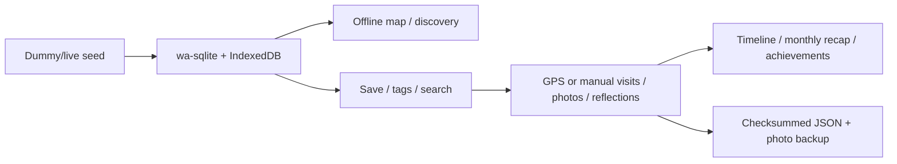

# Hello! My Paso!

Hello! My Paso! is a local-first place-memory app that runs without public API keys or accounts. Discover and save places, record GPS-verified or manual visits, and keep photos and reflections on-device by default. See [README.md](./README.md) for the Korean-first guide.

## Product Flow



## What Works

| Area | Status |
| --- | --- |
| App | Static Next.js app with Capacitor Android/iOS projects |
| Local DB | `wa-sqlite` + IndexedDB; writes are blocked in volatile fallback mode |
| Seed | 100 bundled POIs for keyless testing plus live replacement scripts |
| Map and discovery | Offline map plus name, region, and personal-tag search |
| Personal collection | Saved state and tags stay separate from replaceable POI seeds |
| Journal | GPS/manual verification, photos, reflections, and a dated timeline |
| Optional local AI | User-confirmed localhost/private-LAN drafting, classification, and keywords |
| Insights | Monthly recap, exact level progress, and evidence-based achievements |
| Backup | Validated, atomic restore of records, saved state, and referenced photos |

## Key Paths

| Path | Responsibility |
| --- | --- |
| `src/components/home/HomeWorkspace.tsx` | Product screen and tab orchestration |
| `src/components/tabs/*` | Map, Explore, Journal, and Profile screens |
| `src/hooks/usePasoJournal.ts` | Local state and durable-write gate |
| `src/lib/db/*` | Versioned SQLite migrations and queries |
| `src/lib/media/photo-store.ts` | Web IndexedDB/native-file photo storage |
| `src/lib/export/json-export.ts` | Snapshot validation and compensating restore |
| `src/lib/poi/pois-dummy.json` | Bundled 100-POI seed |
| `scripts/seed-pois.mjs` | Dummy generation and live-data merge |

## Quick Start

```bash
npm install
npm run seed:dummy
npm run dev
```

Open `http://localhost:3000` to exercise core flows without Mapbox or public API keys.

## Seed Replacement

```bash
npm run seed:dummy
npm run seed:live
npm run seed:merge -- --tour=./tmp/tourapi.json --heritage=./tmp/heritage.json
```

Keep secrets in `.env` and never commit them. See [.env.example](./.env.example) for supported variables.

## Optional Local AI and Transfer Boundary

Local AI is optional and no model weights are bundled. The owner supplies a separate OpenAI-compatible Korean model runtime; every manual journal feature remains available when AI is disabled or unconfigured.

- The app accepts HTTP/HTTPS `localhost` or loopback on this device, or an exact HTTPS private-LAN IPv4 endpoint confirmed by the user. HTTP private-LAN, public-internet, cloud, and developer-operated endpoints are blocked; HTTPS private-LAN is allowed after confirmation.
- Nothing is sent until the user reviews the transfer preview and explicitly confirms **Create AI draft with this content**. The request contains the selected place name and note; a vision model may also receive a resized temporary photo copy with EXIF removed.
- An HTTPS private-LAN request is an off-device transfer. Its endpoint operator can process the content, and the transfer is encrypted with platform TLS. HTTP localhost stays on-device.
- The developer does not operate the AI endpoint and does not receive, retain, or inspect its requests. Precise location, photo metadata, other records, and backups are excluded.
- Output is an editable draft only. It is never auto-saved, synchronized, or shared; the user must apply it and complete the normal save action.

## Backup and Permissions

- The Profile tab exports places, visits, reflections, XP, saved state, tags, and referenced photos to JSON.
- Imports verify version, record counts, references, and SHA-256 checksum before previewing the restore.
- Database and media changes are compensated if restore fails.
- Location is used only after the user taps **Check current location**; there is no background tracking.
- Camera or photo access occurs only when the user adds a visit photo.
- Backups can contain location and photo data and are not separately encrypted.
- For private-LAN AI, use a trusted owner-controlled runtime with a valid HTTPS certificate and always review the preview. HTTP private-LAN endpoints are rejected.

## Verification

```bash
npm test
npm run lint
npm run build
npm run build:mobile
npm run cap:sync:android
```
