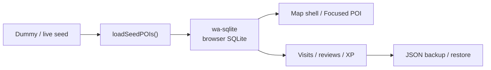

# Hello! My Paso!

This is a local-first travel journal shell that runs immediately without public API keys.  
For the Korean-first explanation, see [README.md](./README.md).

## Overview



## What Works Today

| Area | Status |
| --- | --- |
| App shell | Next.js App Router with static export support |
| Local DB | `wa-sqlite` in the browser |
| Seed data | 100 bundled dummy POIs by default |
| Live replacement seam | `seed:live` and `seed:merge` scripts |
| Map | Safe fallback when Mapbox token is missing |
| Journal | Local visits, reviews, XP, profile updates |
| Backup | JSON export and restore |
| Public hosting | Compatible with GitHub Pages |

## Key Paths

| Path | Responsibility |
| --- | --- |
| `src/app/page.tsx` | Home server shell |
| `src/components/home/HomeWorkspace.tsx` | Client entry for the home page |
| `src/components/map/MapView.tsx` | Map/fallback/focused POI UI |
| `src/components/home/PasoJournal.tsx` | Visit, review, backup/restore UI |
| `src/hooks/usePasoJournal.ts` | Shared local state and actions |
| `src/lib/db/*` | SQLite bootstrap, migrations, queries |
| `src/lib/export/json-export.ts` | Snapshot export and restore |
| `src/lib/poi/pois-dummy.json` | Bundled POI seed |
| `scripts/seed-pois.mjs` | Dummy generation, live fetch, merge |

## Quick Start

```bash
npm install
npm run seed:dummy
npm run dev
```

Open `http://localhost:3000` and you should see the fallback map and local journal even without a Mapbox token.

## Seed Commands

```bash
# Regenerate the bundled 100-item dummy seed
npm run seed:dummy

# Build a bundle directly from configured public endpoints
npm run seed:live

# Merge pre-fetched JSON exports into the bundled seed
npm run seed:merge -- --tour=./tmp/tourapi.json --heritage=./tmp/heritage.json
```

Environment variables expected in `.env.example`:

```bash
NEXT_PUBLIC_MAPBOX_ACCESS_TOKEN=
TOUR_API_URL=
TOUR_API_KEY=
HERITAGE_API_URL=
CHA_API_KEY=
```

## Backup and Restore

The home screen exposes:

- `Export local JSON`: saves the current local snapshot
- `Import local JSON`: replaces the current local state with an imported snapshot

## Verification

```bash
npm run test
npm run lint
npm run build
```
