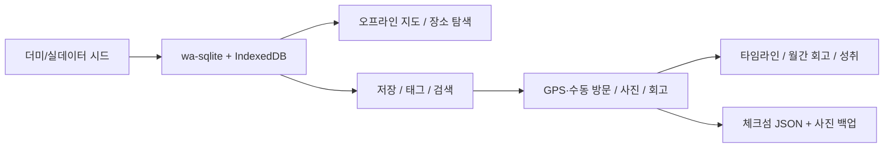

# Hello! My Paso!

API 키와 계정 없이 바로 실행되는 로컬-퍼스트 장소 기억 앱입니다. 장소를 발견하고 저장한 뒤, 현장 또는 수동 방문과 사진·감상을 기기 안에 쌓습니다. 영문 설명은 [README.en.md](./README.en.md)에서 별도로 제공합니다.

## 제품 흐름



## 지금 되는 것

| 항목 | 설명 |
| --- | --- |
| 앱 | Next.js 정적 앱 + Capacitor Android/iOS 프로젝트 |
| 로컬 DB | `wa-sqlite` + IndexedDB, 휘발성 폴백에서는 쓰기 차단 |
| 시드 | API 키 없이 테스트 가능한 100개 POI 번들, 실데이터 교체 스크립트 포함 |
| 지도·탐색 | Mapbox 토큰 없는 오프라인 지도, 이름·지역·개인 태그 검색 |
| 개인 컬렉션 | 교체 가능한 시드와 분리된 저장 상태·태그·방문 상태 |
| 저널 | GPS 확인/수동 방문 구분, 사진, 감상, 날짜별 타임라인 |
| 회고 | 월간 요약, 정확한 레벨 진행, 실제 데이터 기반 성취 |
| 백업 | 전체 기록·사진·저장 정보를 SHA-256과 참조 무결성 검사 후 원자적으로 복원 |

## 핵심 경로

| 경로 | 역할 |
| --- | --- |
| `src/components/home/HomeWorkspace.tsx` | 앱 화면과 탭 상태 통합 |
| `src/components/tabs/*` | 지도, 탐색, 저널, 프로필 화면 |
| `src/hooks/usePasoJournal.ts` | 로컬 상태와 쓰기 안전 게이트 |
| `src/lib/db/*` | 버전드 SQLite 마이그레이션과 쿼리 |
| `src/lib/media/photo-store.ts` | 웹 IndexedDB/네이티브 파일 사진 저장소 |
| `src/lib/export/json-export.ts` | 스냅샷 검증·내보내기·보상 복원 |
| `src/lib/poi/pois-dummy.json` | 기본 100개 POI 시드 |
| `scripts/seed-pois.mjs` | 더미 생성, 실데이터 수집·병합 |

## 빠른 시작

```bash
npm install
npm run seed:dummy
npm run dev
```

`http://localhost:3000`에서 Mapbox나 공공 API 키 없이 주요 흐름을 확인할 수 있습니다.

## 시드 교체

```bash
npm run seed:dummy
npm run seed:live
npm run seed:merge -- --tour=./tmp/tourapi.json --heritage=./tmp/heritage.json
```

비밀 키는 `.env`에만 두고 저장소에는 커밋하지 않습니다. 필요한 변수는 [.env.example](./.env.example)을 참고하세요.

## 백업과 권한

- 프로필의 **내 데이터 보관**에서 장소, 방문, 감상, XP, 저장·태그와 참조 사진을 JSON으로 내보냅니다.
- 가져오기는 버전, 건수, 참조, SHA-256 체크섬을 검사하고 미리보기를 보여준 뒤 실행합니다.
- 복원 중 오류가 나면 DB와 사진을 원래 상태로 되돌립니다.
- 위치는 사용자가 **현재 위치 확인**을 누를 때만 사용하며 백그라운드 추적은 하지 않습니다.
- 카메라·사진은 사용자가 방문 사진을 추가할 때만 사용합니다.
- JSON에는 위치와 사진이 포함될 수 있고 별도 암호화되지 않으므로 안전하게 보관해야 합니다.

## 검증

```bash
npm test
npm run lint
npm run build
npm run build:mobile
npm run cap:sync:android
```

## 문서

- [영문 설명서](./README.en.md)
- [Android 설정](./docs/mobile/android-setup.md)
- [iOS 인계](./docs/mobile/ios-handoff.md)
- [제품 정렬 분석](./docs/product/2026-07-19-benchmark-and-concept-alignment.md)
- [제품 보완 로드맵](./docs/superpowers/plans/2026-07-19-product-alignment-roadmap.md)
