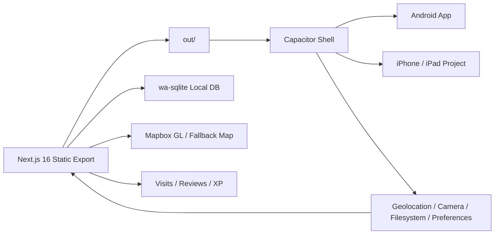

# Hello! My Paso! Mobile Delivery Design

안드로이드 실배포 가능한 상태를 윈도우에서 완성하고, 같은 코드베이스로 아이폰/아이패드용 Xcode 프로젝트까지 준비하는 설계 문서다.  
This document defines a delivery path that finishes Android deployment readiness on Windows and prepares the same codebase for iPhone/iPad handoff through an Xcode project.

## Decision Summary

이번 단계의 기준 아키텍처는 `Next.js static export + Capacitor shell + 기존 wa-sqlite 유지`다. 안드로이드는 윈도우에서 직접 빌드와 에뮬레이터 검증까지 수행하고, iOS는 macOS/Xcode가 필요한 마지막 서명과 실행만 남기도록 준비한다.  
The baseline architecture for this phase is `Next.js static export + Capacitor shell + existing wa-sqlite`. Android will be built and verified on Windows, while iOS will be prepared so that only the final signing and simulator/device execution remain for macOS/Xcode.

웹 배포와 모바일 배포는 같은 코드베이스를 공유하지만 같은 빌드 프로필을 쓰지 않는다. `GitHub Pages`용 빌드는 기존 `basePath`를 유지하고, 모바일 빌드는 `basePath=""`, `assetPrefix=""`를 강제하는 별도 플래그 또는 프로필로 분리한다.  
Web and mobile share the same codebase, but they do not use the same build profile. GitHub Pages keeps the existing `basePath`, while mobile builds must force `basePath=""` and `assetPrefix=""` through a dedicated flag or profile.

이 설계는 저장소에 `build:mobile` 스크립트를 추가하는 것을 전제로 한다. 기준 명령은 `MY_PASO_BUILD_TARGET=mobile npm run build:mobile` 또는 동등한 Windows 호환 스크립트이며, Capacitor는 이 산출물만 사용한다.  
This design assumes the repository adds a `build:mobile` script. The canonical command is `MY_PASO_BUILD_TARGET=mobile npm run build:mobile` or an equivalent Windows-compatible wrapper, and Capacitor must consume only that output.

## Why This Path

현재 저장소는 `Next.js 16 + output: "export" + wa-sqlite + PWA`로 이미 로컬 퍼스트 구조가 정리되어 있다. 따라서 웹 코드를 버리고 React Native로 재작성하는 것보다, Capacitor로 네이티브 셸을 입혀 재사용률을 높이는 편이 비용과 리스크가 가장 낮다.  
The repository already has a clean local-first structure based on `Next.js 16 + output: "export" + wa-sqlite + PWA`. Wrapping it with Capacitor is lower-risk and cheaper than rewriting the product in React Native.

## Constraints

| 항목 | 내용 |
| --- | --- |
| 플랫폼 제약 | 현재 작업 환경은 Windows이며, Android SDK/AVD는 준비 가능하지만 iOS 빌드·시뮬레이터는 macOS + Xcode 없이는 불가 |
| 데이터 원칙 | 핵심 기록 데이터는 계속 온디바이스에만 저장 |
| 앱 구조 | 웹 코드베이스는 하나로 유지하고, Capacitor는 얇은 네이티브 셸 역할만 수행 |
| 배포 목표 | Android APK/AAB 빌드 가능 상태, iOS Xcode 프로젝트/권한/서명 handoff 완료 |
| 설정 분기 | `next.config.ts`는 GitHub Pages와 모바일 build profile을 명시적으로 분리해야 함 |

| Item | Detail |
| --- | --- |
| Platform constraint | The current environment is Windows, so Android SDK/AVD is feasible but iOS build/simulator work still requires macOS + Xcode |
| Data principle | Core journal data must remain on-device only |
| App structure | Keep one shared web codebase, with Capacitor acting as a thin native shell |
| Delivery target | Android APK/AAB readiness, plus iOS Xcode project and signing handoff readiness |
| Config split | `next.config.ts` must explicitly separate GitHub Pages and mobile build profiles |

## Architecture

안드로이드와 iOS는 같은 `out/` 산출물을 사용한다. 웹 앱 내부 로직은 유지하고, 네이티브 플러그인은 `Capacitor.isNativePlatform()` 기준으로 필요한 경우에만 호출한다.  
Android and iOS will consume the same `out/` web bundle. The existing web logic remains intact, and native plugins are only invoked when `Capacitor.isNativePlatform()` indicates a native environment.

단, 이 `out/`은 모바일 전용 export여야 한다. `GITHUB_ACTIONS=true`로 생성된 GitHub Pages 번들은 `/my-paso/...` 경로를 포함하므로 Capacitor 앱에서 그대로 쓰면 안 된다.  
However, that `out/` bundle must be a mobile-specific export. A GitHub Pages bundle built with `GITHUB_ACTIONS=true` contains `/my-paso/...` paths and must not be reused inside Capacitor.

## Component Plan

| 구성요소 | 역할 | 이번 단계 |
| --- | --- | --- |
| `capacitor.config.ts` | 앱 식별자, `webDir`, 스킴, 플러그인 기본값 관리 | 기존 파일 보강 및 검증 |
| `android/` | Android Studio 프로젝트 | 생성, sync, debug build, emulator smoke test |
| `ios/` | Xcode 프로젝트 | 생성, 권한 설정 초안, macOS handoff |
| `src/lib/native/*` | 플랫폼 감지 및 네이티브 API 래퍼 | 추가 |
| `src/lib/geo/*` | 위치 수집과 POI 근접 감지 기반 | 골격만 추가, 백그라운드 추적은 보류 |
| `src/hooks/*` | 네이티브 기능과 UI 연결 | 최소 상태 노출 |
| `docs/mobile/*` | 설치, 테스트, handoff 문서 | 작성 |

| Component | Responsibility | This phase |
| --- | --- | --- |
| `capacitor.config.ts` | Manage app ID, `webDir`, scheme, and plugin defaults | Update and validate the existing file |
| `android/` | Android Studio project | Create, sync, debug build, emulator smoke test |
| `ios/` | Xcode project | Create, draft permissions, macOS handoff |
| `src/lib/native/*` | Platform detection and native API wrappers | Add |
| `src/lib/geo/*` | Position collection and POI proximity foundation | Add only the skeleton, defer background tracking |
| `src/hooks/*` | Bridge native capabilities to UI | Expose minimal state |
| `docs/mobile/*` | Install, test, and handoff docs | Author |

## Data And Storage

기존 `wa-sqlite` 스키마와 쿼리는 유지한다. 이번 단계에서는 저장소 백엔드를 성급하게 바꾸지 않고, 먼저 Capacitor WebView 안에서 현재 로컬 DB가 안정적으로 동작하는지 확인한다. 네이티브 저장소 전환은 실제 WebView 제한이 확인될 때만 별도 작업으로 분리한다.  
The existing `wa-sqlite` schema and queries remain unchanged. This phase validates that the current local database works inside Capacitor WebView before considering any storage backend change. A native storage migration only happens if a concrete WebView limitation appears.

현재 구현 기준 영속성 조건은 `indexedDB`와 `navigator.locks`가 모두 존재할 때만 `indexeddb` 모드가 선택되고, 아니면 자동으로 `memory` 모드로 떨어진다. 따라서 모바일 검증의 핵심 acceptance test는 `initializeDatabase()` 이후 `storageMode === "indexeddb"`를 확인하고, 앱 재실행 뒤에도 방문/리뷰/XP 데이터가 남는지 확인하는 것이다.  
With the current implementation, persistence only uses `indexeddb` mode when both `indexedDB` and `navigator.locks` are available; otherwise it silently falls back to `memory`. The critical mobile acceptance test is therefore to verify `storageMode === "indexeddb"` after `initializeDatabase()` and confirm visits/reviews/XP still exist after a cold restart.

만약 Android WebView나 iOS WKWebView에서 이 조건이 충족되지 않으면 즉시 실패로 기록하고, 후속 작업으로 `@capacitor-community/sqlite` 또는 다른 네이티브 저장소 백엔드를 도입하는 경로를 분리한다. 이번 단계에서는 그 대체안을 구현하지 않고, 실패를 재현 가능하게 남기는 데 집중한다.  
If Android WebView or iOS WKWebView does not satisfy those conditions, that result is treated as a concrete failure signal and split into a follow-up task for `@capacitor-community/sqlite` or another native storage backend. This phase does not implement the fallback backend; it focuses on making the failure reproducible.

이번 단계의 합격 기준은 `Android에서 indexeddb 영속성 확인`이다. iOS는 윈도우에서 직접 검증할 수 없으므로, `ios/` 프로젝트와 검증 체크리스트를 준비하고 `WKWebView persistence smoke test`를 macOS handoff 항목으로 넘긴다. 만약 macOS 검증에서 `memory` 모드로 떨어지면 iOS 배포는 차단하고 네이티브 저장소 후속 작업을 먼저 수행한다.  
The pass condition for this phase is `verified indexeddb persistence on Android`. Because iOS cannot be directly validated from Windows, the `ios/` project and a `WKWebView persistence smoke test` are handed off as explicit macOS tasks. If macOS validation shows a `memory` fallback, iOS release is blocked until a native storage follow-up is completed.

## Permission Matrix

| 기능 | Android 권한/설정 | iOS 권한/설정 | 거부 시 UX |
| --- | --- | --- | --- |
| Geolocation | `ACCESS_COARSE_LOCATION`, `ACCESS_FINE_LOCATION` | `NSLocationWhenInUseUsageDescription` | 기능 비활성화, 수동 기록 흐름 유지, 설정 이동 안내 |
| Camera | `CAMERA` | `NSCameraUsageDescription` | 사진 첨부 UI 숨김 또는 비활성화, 텍스트 기록은 유지 |
| Filesystem | 추가 런타임 권한 없이 앱 전용 저장소 우선 | 앱 샌드박스 저장소 | 백업/복원 버튼에서 실패 이유 표시 |
| Preferences | 별도 권한 없음 | 별도 권한 없음 | 기본값으로 계속 동작 |

| Capability | Android permission/config | iOS permission/config | Denial UX |
| --- | --- | --- | --- |
| Geolocation | `ACCESS_COARSE_LOCATION`, `ACCESS_FINE_LOCATION` | `NSLocationWhenInUseUsageDescription` | Disable the feature, keep manual journaling, and offer a settings prompt |
| Camera | `CAMERA` | `NSCameraUsageDescription` | Hide or disable photo attachment while preserving text journaling |
| Filesystem | Prefer app-private storage with no extra runtime permission | App sandbox storage | Show a clear backup/restore failure reason |
| Preferences | No extra permission | No extra permission | Continue with defaults |

권한 요청은 앱 시작 시 일괄 요청하지 않고, 사용자가 해당 기능에 처음 진입할 때만 요청한다. 거부된 경우 앱 전체를 막지 않고 해당 기능만 비활성화한다.  
Permissions are not requested upfront at app launch. Each permission is requested only when the user enters the corresponding feature for the first time, and a denial disables only that feature rather than blocking the whole app.

## Native Capability Scope

| 기능 | 이번 단계 처리 |
| --- | --- |
| Geolocation | 플러그인 연결 골격과 권한 흐름만 추가 |
| Camera | 플러그인 래퍼와 호출 지점만 준비 |
| Filesystem | 앱 내부 백업/복원 확장 가능성 기준으로 래퍼 추가 |
| Preferences | 앱 설정값 저장 기본 래퍼 추가 |
| Splash / StatusBar | 기본 앱 셸 정리 |
| Background tracking | 제외 |
| Push notification | 제외 |

| Capability | This phase |
| --- | --- |
| Geolocation | Add wrapper skeleton and permission flow only |
| Camera | Prepare plugin wrapper and call sites |
| Filesystem | Add wrapper for future backup/restore extensions |
| Preferences | Add a basic settings wrapper |
| Splash / StatusBar | Clean up the native shell basics |
| Background tracking | Out of scope |
| Push notification | Out of scope |

## Test Plan

| 검증 축 | 합격 기준 |
| --- | --- |
| 웹 회귀 | `npm run test`, `npm run lint`, `npm run build` 통과 |
| Capacitor sync | `npx cap sync` 성공 |
| Android build | 디버그 APK 또는 Android Studio 빌드 성공 |
| Android phone test | 세로 폰 에뮬레이터에서 홈/맵/저널 렌더 확인 |
| Android tablet test | 가로 태블릿 에뮬레이터에서 레이아웃 확인 |
| 로컬 데이터 유지 | 앱 재시작 후 seed/기록/XP 상태 유지 |
| Geolocation smoke | 권한 요청, 허용/거부 분기, 위치값 또는 graceful fallback 확인 |
| Camera smoke | 권한 요청과 취소/거부 처리 확인 |
| Filesystem smoke | 로컬 백업 파일 쓰기 또는 실패 메시지 확인 |
| iOS readiness | `ios/` 프로젝트 생성, 권한/서명/handoff 문서 완성 |

| Verification axis | Pass criteria |
| --- | --- |
| Web regression | `npm run test`, `npm run lint`, `npm run build` all pass |
| Capacitor sync | `npx cap sync` succeeds |
| Android build | Debug APK or Android Studio build succeeds |
| Android phone test | Home/map/journal render in a portrait phone emulator |
| Android tablet test | Layout looks correct in a landscape tablet emulator |
| Local data persistence | Seed, journal, and XP state survive app restarts |
| Geolocation smoke | Verify permission prompt, allow/deny branches, and either a position result or graceful fallback |
| Camera smoke | Verify permission prompt and cancel/deny handling |
| Filesystem smoke | Verify local backup file write or a clear failure message |
| iOS readiness | `ios/` project exists and permissions/signing/handoff docs are complete |

## Reproducible Command Surface

| 단계 | 명령 또는 조건 |
| --- | --- |
| Node 확인 | `node -v`가 22 이상이어야 함 |
| Android 준비 | JDK 17+, Android Studio, `platform-tools`, emulator, system image 설치 |
| 웹 회귀 | `npm install`, `npm run test`, `npm run lint`, `npm run build` |
| 모바일 스크립트 추가 | `package.json`에 `build:mobile`, `cap:sync`, `cap:android`, `cap:ios` 추가 |
| 모바일 export | `MY_PASO_BUILD_TARGET=mobile npm run build:mobile` 또는 동등한 Windows 스크립트 |
| Capacitor sync | `npx cap sync android`, `npx cap sync ios` |
| Android 실행 | `emulator -avd <name>`, `adb devices`, Android Studio 또는 Gradle debug build |
| iOS 인계 | macOS에서 `npx cap open ios` 후 Xcode signing 설정 |

| Step | Command or requirement |
| --- | --- |
| Verify Node | `node -v` must be 22 or higher |
| Prepare Android | Install JDK 17+, Android Studio, `platform-tools`, emulator, and a system image |
| Web regression | `npm install`, `npm run test`, `npm run lint`, `npm run build` |
| Add mobile scripts | Add `build:mobile`, `cap:sync`, `cap:android`, and `cap:ios` to `package.json` |
| Mobile export | Run `MY_PASO_BUILD_TARGET=mobile npm run build:mobile` or an equivalent Windows wrapper |
| Capacitor sync | `npx cap sync android`, `npx cap sync ios` |
| Android run | `emulator -avd <name>`, `adb devices`, then build/debug through Android Studio or Gradle |
| iOS handoff | On macOS, run `npx cap open ios` and complete signing in Xcode |

## Deliverables

1. Capacitor가 연결된 모바일 앱 코드베이스
2. Android 디버그 빌드와 에뮬레이터 테스트 결과
3. iOS Xcode 프로젝트와 macOS 인계 문서
4. Claude Code가 바로 이어받을 수 있는 실행 순서와 체크리스트

1. A mobile-ready codebase with Capacitor integrated
2. Android debug build output and emulator test results
3. An iOS Xcode project plus macOS handoff documentation
4. An execution checklist that Claude Code can continue from immediately

## Risks And Mitigations

| 리스크 | 대응 |
| --- | --- |
| Android SDK/AVD 미설치 | 설치 절차와 환경 변수 정리를 문서화하고 자동화 가능한 범위는 스크립트화 |
| WebView 저장소 제약 | 기존 wa-sqlite를 우선 검증하고, 실패 시 대체 백엔드를 후속 작업으로 분리 |
| Mapbox 토큰 부재 | 기존 fallback 맵 UI를 계속 유지 |
| iOS 직접 검증 불가 | Xcode project + signing checklist + Claude handoff로 위험을 분리 |

| Risk | Mitigation |
| --- | --- |
| Android SDK/AVD not installed | Document and script the setup where practical |
| WebView storage limitations | Validate existing wa-sqlite first and isolate fallback storage as later work |
| Missing Mapbox token | Keep the existing fallback map UI |
| No direct iOS verification | Isolate the gap through an Xcode project, signing checklist, and Claude handoff |

## Non-Goals

이번 단계에서는 서버 동기화, 사용자 계정, 푸시 알림, 백그라운드 위치 추적, 스토어 메타데이터 자동 업로드를 하지 않는다. 목표는 `실제 배포 가능한 Android 앱`과 `즉시 이어받을 수 있는 iOS 준비 상태`다.  
This phase does not include server sync, user accounts, push notifications, background location tracking, or store metadata automation. The goal is a truly deliverable Android app and an iOS project that can be finished immediately on macOS.
