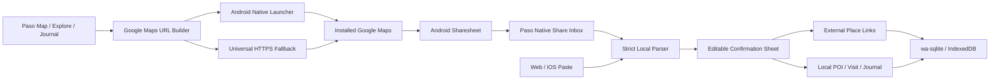

# Google Maps Companion Design

**Date:** 2026-07-31  
**Status:** Approved direction, implementation pending  
**Target:** Android first, web/iOS graceful fallback  

## Decision Summary

Google Maps를 세계 장소 검색, 저장 목록, 길찾기, 내비게이션의 원본으로 사용한다. Hello! My Paso!는 Google Maps를 복제하지 않고 방문 메모, 사진, 감정, 회고를 기기에만 보관하는 로컬 기억층으로 남는다.

이번 기능의 핵심 왕복 흐름은 두 가지다.

1. Paso에서 장소를 고르고 설치된 Google Maps에서 보거나 길찾기를 시작한다.
2. Google Maps에서 발견한 장소를 Android 공유 시트의 `Hello! My Paso!` 대상으로 보내고, Paso에서 확인·수정한 뒤 로컬 기록으로 연결한다.

Google 로그인, OAuth 토큰, 개인 Saved 목록 조회·수정, Places API, 서버 동기화는 도입하지 않는다. Google Maps 안에서 장소를 Saved 목록에 넣는 행위와 성공 여부는 언제나 사용자가 Google Maps UI에서 직접 관리한다.

## Product Contract

| 구분 | Google Maps | Hello! My Paso! |
| --- | --- | --- |
| 장소 검색과 세계 POI | 원본 | 복제하지 않음 |
| 개인 Saved 목록 | 원본 | 읽거나 쓰지 않음 |
| 지도 표시와 길찾기 | 주 사용 도구 | 기록된 추억의 로컬 개요 |
| 방문 메모·사진·감정 | 자동 전송하지 않음 | 기기 로컬 원본 |
| 계정 | 사용자의 기존 Google 계정 | 계정 없음 |
| 데이터 이동 | 사용자가 명시적으로 공유 | 공유된 최소 장소 링크만 수신 |

Paso의 내부 지도는 폐기하지 않는다. 역할을 `장소 발견 지도`에서 `내가 기록한 기억 지도`로 명확히 낮춘다. 세계 장소의 검색·저장·내비게이션은 Google Maps에 위임한다.

## Supported And Unsupported Integration

Google의 공식 Maps URL은 앱 키 없이 검색, 지도 표시, 길찾기, Street View를 열 수 있다. Android는 Google Maps 패키지를 지정한 intent도 지원한다. 이 공식 기능 목록에는 개인 Saved 목록의 읽기·쓰기나 저장 성공 콜백이 없다.

- [Google Maps URLs](https://developers.google.com/maps/documentation/urls/get-started)
- [Google Maps intents for Android](https://developer.android.com/guide/components/google-maps-intents)
- [Google Maps URL scheme for iOS](https://developers.google.com/maps/documentation/urls/ios-urlscheme)
- [Receive text through the Android Sharesheet](https://developer.android.com/training/sharing/receive)

따라서 Paso는 다음 표현을 사용하지 않는다.

- `Google Maps에 저장됨`
- `Google Maps와 동기화됨`
- `Saved 목록을 가져옴`

대신 `Google Maps에서 열기`, `Google Maps에서 길찾기`, `Google Maps에서 받은 장소`, `Paso에 로컬 기록`을 사용한다.

## User Flows

### Flow A: Paso To Google Maps

1. 사용자가 Map 또는 Explore에서 Paso 장소를 선택한다.
2. 장소 카드에 `Google Maps에서 보기`와 `길찾기`를 표시한다.
3. Paso는 선택한 장소 ID와 시작 시각만 앱 전용 Preferences에 임시 저장한다.
4. Android에서는 설치된 `com.google.android.apps.maps`를 우선 실행한다.
5. Google Maps가 없거나 intent 실행에 실패하면 같은 HTTPS Maps URL을 기본 브라우저로 연다.
6. 사용자가 Paso로 돌아오면 기존 선택 장소를 복원하고 `이 장소 기록 이어쓰기`를 보여준다.
7. 방문 기록이 완료되거나 사용자가 닫으면 임시 세션을 삭제한다.

Google Maps에서 Saved 목록에 저장했는지는 묻거나 추측하지 않는다. Paso 기록 성공과 외부 지도 실행 성공은 서로 독립적인 상태다.

### Flow B: Google Maps To Paso On Android

1. 사용자가 Google Maps 장소 화면에서 `공유`를 선택한다.
2. Android Sharesheet에서 `Hello! My Paso!`를 선택한다.
3. Android `ACTION_SEND`의 `text/plain` 내용을 네이티브 브리지가 읽는다.
4. 브리지는 원문을 DB에 쓰지 않고 웹 UI에 한 번 전달한다.
5. Paso는 허용된 Google Maps HTTPS URL 한 개와 표시 이름 후보만 추출한다.
6. 확인 시트에서 사용자가 이름을 수정하고 다음 중 하나를 선택한다.
   - `지금 방문 기록`: 현재 위치 확인 또는 URL에 포함된 좌표로 로컬 POI와 방문 기록을 만든다.
   - `나중에 기록`: Google Maps 링크와 이름만 로컬 초안으로 보관한다.
   - `Google Maps에서 다시 열기`: 기록하지 않고 원본 장소를 다시 연다.
   - `취소`: 아무것도 저장하지 않는다.
7. 좌표가 없는 초안은 목록에는 나타나지만 기억 지도에는 표시하지 않는다.
8. 사용자가 해당 장소에서 방문 기록을 만들면 현장 GPS 좌표를 사용해 로컬 POI를 만들고 초안을 연결한다.

Android 공식 지침에 맞춰 수신 내용은 저장 전 반드시 확인·수정할 수 있게 한다.

### Flow C: Web And iOS Fallback

Map 또는 Journal에 `Google Maps 링크 붙여넣기` 진입점을 제공한다. Android 공유 수신과 같은 파서·확인 시트를 재사용한다.

iOS에서는 outbound Universal Link를 지원한다. 네이티브 Share Extension은 App Group, 별도 extension target, macOS/Xcode 서명·실기기 검증이 필요하므로 이번 Windows 구현의 출시 차단 조건으로 삼지 않는다. 동일한 붙여넣기 흐름을 먼저 제공하고, iOS Share Extension은 macOS 전달 항목으로 명시한다.

## Architecture



구성요소는 다음 경계를 가진다.

| 구성요소 | 책임 | 의존성 |
| --- | --- | --- |
| `src/lib/maps/google-maps-url.ts` | 검색·보기·길찾기 URL 생성, 허용 URL 검증 | 표준 `URL` |
| `src/lib/maps/google-maps-share.ts` | 공유 텍스트에서 이름·URL·명시 좌표 추출 | 네트워크 없음 |
| `src/lib/native/external-maps.ts` | 네이티브 실행 및 HTTPS fallback | Capacitor custom plugin |
| `src/lib/native/share-inbox.ts` | cold start와 `onNewIntent` 공유 수신 | Android custom plugin |
| `src/lib/db/external-place-links.ts` | 외부 링크 초안과 POI 연결 CRUD | 기존 wa-sqlite |
| `GoogleMapsPlaceSheet` | 확인·수정·취소·기록 UX | 공용 파서와 journal controller |
| Android native plugin | `ACTION_SEND` 수신, Google Maps 실행 | `MainActivity`, Capacitor Plugin API |

외부 지도 로직은 기존 Journal, XP, 사진 저장 로직을 직접 수정하지 않는다. 확인된 장소만 기존 controller의 명시적 입력으로 넘긴다.

## Android Native Contract

`AndroidManifest.xml`의 기존 `singleTask` MainActivity에 다음 수신 범위만 추가한다.

- action: `android.intent.action.SEND`
- category: `android.intent.category.DEFAULT`
- MIME: `text/plain`

`*/*`, 이미지, 파일, 복수 공유는 받지 않는다. MainActivity는 launcher 실행과 share 실행을 구분한다.

custom Capacitor plugin은 다음 API만 노출한다.

```ts
type IncomingShare = {
  text: string;
  receivedAt: string;
};

getPendingShare(): Promise<IncomingShare | null>;
acknowledgePendingShare(): Promise<void>;
addListener("shareReceived", handler): Promise<PluginListenerHandle>;
openGoogleMaps(options: { url: string }): Promise<{
  target: "google-maps" | "browser";
}>;
```

Cold start에서는 Activity intent를 `getPendingShare()`로 읽고, 실행 중 새 공유는 `onNewIntent()`에서 listener로 전달한다. 사용자가 확인 시트를 볼 수 있게 된 뒤에만 acknowledge한다. 앱 밖의 영구 저장소나 로그에는 원문을 남기지 않는다.

Google Maps 실행은 명시적 패키지 intent를 먼저 시도하고 `ActivityNotFoundException`을 처리해 범용 HTTPS URL로 폴백한다. 설치 앱 목록을 수집하거나 분석하지 않는다.

## URL And Input Safety

허용하는 입력은 HTTPS Google Maps 링크로 제한한다.

- `www.google.com/maps/...`
- `maps.google.com/...`
- `maps.app.goo.gl/...`
- `goo.gl/maps/...`

국가별 Google 도메인은 공식 URL 패턴을 따르되, 첫 구현은 위 allowlist만 허용한다. 추가 도메인은 테스트 fixture와 함께 명시적으로 확장한다.

검증 규칙:

- 공유 원문 최대 8 KiB
- URL 최대 2,048자
- 표시 이름 최대 160자
- URL userinfo, 비 HTTPS scheme, 제어 문자 거부
- 허용 URL은 fragment와 알려진 지도 파라미터만 보존
- 추적 또는 계정 식별 가능성이 있는 알 수 없는 query parameter는 제거
- 단축 URL은 네트워크로 풀거나 HTML을 스크레이핑하지 않고 그대로 안전 링크로 보관
- 원문 공유 텍스트는 확인 후 즉시 폐기

좌표는 URL에 명시된 검증 가능한 형식만 읽는다. 좌도는 `-90..90`, 경도는 `-180..180` 범위를 벗어나면 무시한다. 좌표가 없다는 이유로 임의의 `0,0` 값을 만들지 않는다.

## Local Data Model

DB migration v4에서 독립 테이블을 추가한다.

```sql
CREATE TABLE external_place_links (
  id TEXT PRIMARY KEY,
  provider TEXT NOT NULL CHECK (provider = 'google_maps'),
  external_url TEXT NOT NULL,
  display_name TEXT NOT NULL,
  latitude REAL,
  longitude REAL,
  poi_id TEXT REFERENCES pois(id) ON DELETE SET NULL,
  created_at TEXT NOT NULL DEFAULT (datetime('now')),
  updated_at TEXT NOT NULL DEFAULT (datetime('now')),
  UNIQUE(provider, external_url)
);

CREATE INDEX idx_external_place_links_poi
  ON external_place_links(poi_id);
```

기존 `pois.latitude`와 `pois.longitude`는 NOT NULL이므로 좌표 없는 공유 장소를 가짜 POI로 만들지 않는다. 좌표 없는 항목은 `external_place_links` 초안으로 남는다. GPS 또는 명시 좌표가 확보된 시점에 `source='google_maps_share'`, `category='custom'`인 POI를 만들고 `poi_id`를 연결한다.

같은 정규화 URL은 자동으로 중복 생성하지 않고 기존 링크를 연다. 이름·근접 좌표만 비슷한 다른 URL은 자동 병합하지 않고 기존 장소 연결 후보를 사용자에게 보여준다.

Google Maps 링크를 삭제해도 POI, 방문, 리뷰, 사진은 삭제하지 않는다. POI가 삭제되면 `ON DELETE SET NULL`로 링크 초안만 독립 보존한다.

## Backup And Restore

백업 형식을 `2.2-local`, snapshot schema version `3`으로 올리고 `external_place_links`와 해당 record count를 추가한다.

- 새 백업은 외부 지도 링크가 포함된다는 경고를 내보내기 UI에 표시한다.
- `2.0-local`, `2.1-local`, `0.2.0-local` 백업은 외부 링크가 없는 정상 레거시 백업으로 계속 읽는다.
- 복원 순서는 POI 다음에 외부 링크이며, 없는 `poi_id`는 검증 오류로 처리한다.
- checksum, 레코드 수, 참조 무결성 검증에 새 테이블을 포함한다.
- 복원 실패 시 기존 트랜잭션과 미디어 보상 롤백 계약을 유지한다.

Google 토큰, 쿠키, 계정 식별자, 공유 원문은 백업에 포함하지 않는다.

## UI Changes

### Map

- 선택 장소 카드: `Google Maps에서 보기`, `길찾기`, `방문 기록하기`
- 상단 보조 진입점: `Google Maps 링크 붙여넣기`
- 내부 지도 설명: `기록한 장소를 기기에서 돌아보는 기억 지도`
- 기본 지도 데이터는 방문했거나 사용자가 로컬 저장한 장소와 좌표가 확인된 Google Maps 연결 장소로 제한
- 기존 번들 POI는 삭제하지 않고 Explore의 로컬 참고 장소로 유지
- 기억 지도가 비어 있으면 `Google Maps에서 장소 찾기`와 `링크 붙여넣기`를 첫 행동으로 제공

### Journal

- 복귀 세션이 있으면 `Google Maps에서 보던 장소의 기록을 이어가세요` 카드 표시
- 좌표 없는 외부 초안은 `Google Maps에서 받은 장소` 목록으로 표시
- 초안에서 `다시 열기`, `현재 위치로 기록`, `삭제` 제공

### Confirmation Sheet

- 수정 가능한 장소 이름
- 정규화된 Google Maps 호스트 표시
- 좌표 존재 여부와 현재 위치 사용 여부
- `지금 방문 기록`, `나중에 기록`, `다시 열기`, `취소`
- 저장 전에는 DB 변경 없음

Google 브랜드 로고를 임의로 복제하지 않고 텍스트 중심 버튼을 사용한다.

## Error Handling

| 상황 | 사용자 처리 | 데이터 처리 |
| --- | --- | --- |
| Google Maps 미설치 | 브라우저로 열었다고 안내 | Paso 기록 영향 없음 |
| 외부 앱 실행 전체 실패 | 링크 복사 제공 | Paso 기록 영향 없음 |
| Google 이외 링크 공유 | 지원 링크 안내와 붙여넣기 유지 | 저장 없음 |
| 공유 텍스트가 너무 큼 | 안전상 처리하지 않았다고 안내 | 원문 폐기 |
| 이름 없음 | 사용자가 이름을 입력할 때까지 저장 비활성화 | 저장 없음 |
| 좌표 없음 | 초안 저장 또는 현장 GPS 선택 | 가짜 좌표 생성 금지 |
| 위치 권한 거부 | 링크 초안과 수동 기록 유지 | 앱 전체 차단 없음 |
| DB가 memory mode | 외부 링크·방문 영구 저장 비활성화 | 외부 지도 열기는 허용 |
| 백업 복원 오류 | 기존 검사 결과 표시 | 원자적 롤백 |

## Privacy And Security

- Google 계정 인증과 OAuth를 추가하지 않는다.
- Paso 메모, 사진, 감정, 방문 좌표를 Google에 자동 전송하지 않는다.
- Maps URL 실행은 사용자의 명시적 버튼 동작에서만 발생한다.
- 공유 수신은 사용자가 Android Sharesheet에서 Paso를 직접 선택한 경우에만 발생한다.
- analytics, telemetry, URL resolver 서버를 추가하지 않는다.
- 앱 로그에 URL, 공유 텍스트, 좌표를 기록하지 않는다.
- `public/privacy.html`과 Play Data Safety 설명에 앱 간 사용자 주도 공유와 로컬 보관을 명시한다.
- 외부 링크는 위치·여행 패턴을 드러낼 수 있으므로 백업 경고에 포함한다.

## Test Strategy

### Unit And Component Tests

- 보기·검색·길찾기 Maps URL 생성과 인코딩
- 허용 host, HTTPS, 길이, 제어 문자 검증
- 공유 이름·URL·좌표 추출 fixture
- 단축 URL을 네트워크 없이 보존
- migration v4 신규 설치와 v3 업그레이드
- 외부 링크 CRUD, URL 중복, `ON DELETE SET NULL`
- 좌표 없는 초안이 POI로 잘못 생성되지 않음
- 확인 전 DB 변경 없음
- 확인·취소·재열기 UI 분기
- legacy backup import와 2.2-local round trip
- 기존 Map, Journal, Explore, Profile 회귀

### Android Verification

다음 명령과 동등한 intent로 cold start와 warm start를 각각 검증한다.

```powershell
adb shell am start `
  -a android.intent.action.SEND `
  -t text/plain `
  --es android.intent.extra.TEXT "장소 이름 https://maps.app.goo.gl/example" `
  com.mypaso.app
```

합격 조건:

1. Sharesheet 또는 adb intent에서 Paso가 열리고 확인 시트가 한 번만 나타난다.
2. launcher 실행은 공유 시트를 잘못 열지 않는다.
3. Google Maps 설치 시 앱을 열고, 미설치 시 HTTPS fallback이 열린다.
4. 외부 앱 왕복 뒤 선택 장소와 기록 이어쓰기 상태가 유지된다.
5. 강제 종료·재실행 뒤 확인 완료된 링크와 방문만 남는다.
6. URL·공유 원문·좌표가 logcat에 나타나지 않는다.
7. phone portrait와 tablet landscape에서 확인 시트가 정상 표시된다.

### Full Regression

- `npm run test`
- `npm run lint`
- `npm run build`
- `npm run build:mobile`
- `npm run cap:sync:android`
- Android Gradle unit test
- Android release APK/AAB build
- 기존 로컬 DB 재실행 영속성
- 기존 JSON 백업·초기화·복원

## Rollout

Android에서 기능 플래그 없이 제공하되, 네이티브 공유 브리지를 사용할 수 없는 web/iOS에서는 링크 붙여넣기만 노출한다. 기존 alpha 배포 증거 형식을 따라 phone/tablet 스크린샷, 공유 cold/warm start, 외부 앱 fallback, 백업 round trip을 새 검증 보고서에 기록한다.

Google Maps 자체의 Saved 목록 또는 UI 변화는 Paso 오류로 취급하지 않는다. 공유 텍스트 형식이 달라지는 경우에는 안전하게 확인 시트의 수동 이름 입력으로 축소하고, fixture를 확보한 뒤 파서를 확장한다.

## Non-Goals

- Google Saved 목록 실시간 읽기·쓰기·양방향 동기화
- Google 로그인 또는 OAuth
- Places API와 과금 API 키
- Google Maps 내부 저장 성공 판정
- 비공식 endpoint, 접근성 자동화, 화면 스크레이핑
- 백그라운드 위치 추적
- 자동 여행 경로 수집
- 서버 기반 단축 URL 해석
- Google Maps 리뷰 자동 게시
- 이번 Windows 단계에서의 iOS Share Extension 서명·실기기 검증

## Acceptance Criteria

이 기능은 다음 조건을 모두 만족할 때 완료다.

1. Android의 설치된 Google Maps에서 Paso 장소 보기와 길찾기가 가능하다.
2. Google Maps의 `text/plain` 장소 공유를 Paso가 cold/warm start에서 받는다.
3. 사용자가 확인하기 전에는 어떤 장소 데이터도 저장하지 않는다.
4. 공유 URL과 이름만으로 좌표 없는 로컬 초안을 안전하게 만들 수 있다.
5. 현장 GPS 또는 명시 좌표가 있을 때 기존 방문·사진·메모·XP 흐름으로 연결된다.
6. Google Maps가 없어도 브라우저와 링크 붙여넣기로 핵심 흐름이 유지된다.
7. Google 계정·토큰·개인 Saved 목록 접근이 전혀 없다.
8. 새 외부 링크가 검증된 백업·복원에 포함되고 기존 백업도 호환된다.
9. 테스트, lint, web/mobile build, Capacitor sync, Android release build가 통과한다.
10. 실제 Android phone/tablet 검증 증거와 개인정보 문서가 갱신된다.
