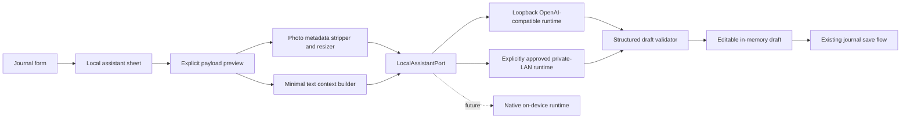

# Local AI-assisted journaling and visual refresh design

**Date:** 2026-08-10
**Status:** Approved for implementation
**Target release:** 0.3.0
**Platforms:** Web/PWA and Android first; iOS-compatible static app with native-runtime work deferred

## Decision summary

Hello! My Paso! will add AI only where it removes friction from personal journaling. A user may select a photo and/or enter a short note, inspect exactly what will be sent to a local runtime, and ask for an editable Korean draft. The assistant may suggest a title, body, place category, keywords, mood wording, and accessible photo description. Nothing is written to the journal until the user edits and confirms it through the existing save flow.

The app will not bundle model weights in this release. It will connect to an OpenAI-compatible runtime owned by the user on the same device or an explicitly approved private-LAN host. Vendor presets cover Korean model families from NAVER, Kakao, LG AI Research, and SK Telecom without making any model a required dependency. Model licenses remain the runtime owner's responsibility, and the app will link to the applicable model card instead of redistributing weights.

The visual update will unify the existing bright product UI and dark amber archive motif with restrained, GPT-image-generated memory-trail textures. Generated artwork remains decorative and must never look like a user's real photo, an actual POI, or an accurate map.

## Product contract

### The assistant does

- Work only after the user presses `AI로 빠르게 작성`.
- Use only the photo, place name, and short note visible in the request preview.
- Strip photo metadata and resize a transient copy before inference.
- Return suggestions as an editable draft.
- Explain whether the selected runtime supports text only or text plus images.
- Preserve the fully manual journal flow when AI is disabled or unavailable.

### The assistant never does

- Scan the photo library, journal database, backup archive, or location history.
- Send precise coordinates, EXIF data, photo identifiers, or unrelated records.
- Use a public cloud endpoint.
- Invent a verified fact about a place based only on a photo.
- Auto-save, auto-publish, award XP, or overwrite user text.
- Run in the background or contact a model at app startup.

## User flow

1. The user selects a place and optionally adds a photo or short note in Journal.
2. `AI로 빠르게 작성` opens a local-assistant sheet.
3. The sheet shows the selected runtime, endpoint scope, and an exact payload preview:
   - photo thumbnail if the model is vision-capable;
   - place name if selected;
   - current short note;
   - an explicit list of excluded data.
4. The user chooses one intent: `기록 초안`, `분류와 키워드`, or `사진 설명`.
5. The app creates a metadata-free, downscaled image copy and calls the configured local runtime.
6. The response is validated and displayed as suggestions. Each field can be edited or excluded.
7. `초안에 적용` copies selected values into the existing form without touching the database.
8. The user edits the form and presses the existing save action. Only this action persists data and awards XP.

If no photo is selected, the same flow works from text. If the configured model is text-only, the sheet clearly excludes the photo and never silently uploads it.

## Runtime approaches and chosen architecture

The release uses a staged hybrid architecture.



### Component boundaries

| Component | Responsibility | Must not depend on |
| --- | --- | --- |
| `src/lib/ai/contracts.ts` | Runtime, request, draft, capability, and error contracts | React, SQLite |
| `src/lib/ai/model-catalog.ts` | Vendor presets, model-card links, and declared capabilities | Network, model weights |
| `src/lib/ai/endpoint-policy.ts` | Validate loopback/private endpoint scope before every request | UI state |
| `src/lib/ai/photo-sanitizer.ts` | Decode, re-encode, resize, and strip metadata from transient photo input | Journal database |
| `src/lib/ai/context-builder.ts` | Construct the minimal visible request and Korean system instruction | Hidden profile or location data |
| `src/lib/ai/openai-compatible.ts` | Make one bounded chat-completions request and reject redirects | App persistence |
| `src/lib/ai/draft-validator.ts` | Parse and constrain structured suggestions | Runtime implementation |
| `src/lib/ai/preferences.ts` | Store non-secret endpoint/model settings locally | API keys |
| `src/hooks/useLocalAssistant.ts` | Coordinate connection test, cancellation, and draft state | Direct database writes |
| `src/components/ai/*` | Settings, payload preview, progress, errors, and draft editor | Model-specific protocols |

`usePasoJournal`, migrations, XP logic, and backup formats remain unchanged because AI output is not a new persisted entity. Applied suggestions become ordinary user-edited journal fields.

## Model-family support

The catalog provides vendor presets without downloading or embedding any weights.

| Vendor family | Suggested text profile | Suggested vision profile | Product treatment |
| --- | --- | --- | --- |
| NAVER HyperCLOVA X SEED | `HyperCLOVAX-SEED-Text-Instruct-0.5B` or a user override | `HyperCLOVAX-SEED-Vision-Instruct-3B` | Dedicated license link and capability notice |
| Kakao Kanana | `kanana-2-1.3b-instruct` or a user override | `kanana-1.5-v-3b-instruct` | Dedicated license and required-attribution notice |
| LG EXAONE | `EXAONE-4.0-1.2B` or a user override | `EXAONE-4.5-33B` or a user override | Research/non-commercial warning; no bundled distribution |
| SK Telecom A.X | `A.X-4.0-Light` or a user override | `A.X-4.0-VL-Light` | Large-runtime warning; desktop/NAS recommended |

The endpoint's actual model identifier is editable because local runtimes often expose aliases or quantized conversions. Selecting a vendor changes only defaults and documentation; it does not claim that the model is installed or licensed.

## Endpoint and privacy policy

### Allowed by default

- `http://127.0.0.1:<port>`
- `http://localhost:<port>`
- `http://[::1]:<port>`

### Allowed only after an ownership warning and explicit user enablement

- Literal IPv4 addresses in `10.0.0.0/8`
- Literal IPv4 addresses in `172.16.0.0/12`
- Literal IPv4 addresses in `192.168.0.0/16`
- HTTPS endpoints on those same literal private addresses

### Rejected

- Public IPs and public hostnames
- Non-HTTP(S) schemes
- URL credentials or query-string secrets
- Redirects
- `.local` and other hostnames whose resolved address cannot be proven client-side
- Requests after the endpoint has changed without renewed ownership confirmation

This release does not store or send API keys. Connection testing sends only a minimal health/model request and no journal content. Each generation request revalidates the endpoint.

### Photo boundary

- The original photo remains in the existing local photo store.
- A transient inference copy is rendered through a canvas or equivalent decode/re-encode path.
- Longest edge is limited to 1280 pixels.
- Output is JPEG or WebP at approximately 82% quality, with no original filename or metadata.
- The inference copy is held in memory and released after completion or cancellation.
- The payload preview shows the actual resized thumbnail and warns that visual content will be sent to the selected local device.

## Request and response contract

The client requests JSON-only output with the following bounded shape:

```ts
type LocalAIDraft = {
  title: string;
  body: string;
  category: POICategory | null;
  keywords: string[];
  mood: string | null;
  altText: string;
  observations: string[];
};
```

Limits:

- title: 80 characters
- body: 1,000 characters
- keywords: at most 8, each at most 24 characters
- mood: 24 characters
- alt text: 240 characters
- observations: at most 5, each at most 120 characters

The prompt distinguishes visible observations from interpretation. The model must not assert a location, person identity, date, ownership, or historical fact that is not in the user's provided text. The validator drops unknown keys, normalizes whitespace, filters unsupported categories, and reports malformed output without modifying the journal form.

## Interface design

### Journal integration

- Keep the four-tab navigation; do not add an AI tab.
- Place `AI로 빠르게 작성` beside the photo/note actions only when a runtime is configured.
- When unconfigured, show a quiet `로컬 AI 연결` entry that opens settings instead of a disabled primary button.
- Use a bottom sheet on phones and a centered dialog on wide screens.
- The payload preview is a mandatory step; a remembered endpoint does not skip it.
- Generated fields carry a `AI 초안` label until the user edits or saves them.

### Local AI settings

- Add a `로컬 AI` section under Profile owner controls.
- Fields: enable switch, vendor preset, endpoint, model ID, text/vision capability, and connection test.
- Show one of three locality badges: `이 기기`, `이 브라우저의 localhost`, `내 사설망 기기`.
- Present the model-card/license link and never imply endorsement or partnership.

### Visual refresh

- Introduce shared tokens for surface radius, shadow, amber trail, paper texture, and focus ring.
- Generate two decorative brand assets with GPT Image: a dark memory-trail texture and a light paper-trail texture. No text, people, landmark, logo, map, or simulated user photo.
- Reuse the texture sparingly in Profile, Journal header, Explore header, and the local-assistant sheet.
- Clarify the current offline canvas as `장소 분포도 · 길찾기용 아님`.
- Add visible `:focus-visible` treatment and `aria-current` to navigation.
- Preserve 44-pixel touch targets, reduced-motion behavior, and readable 12-pixel minimum informational text.
- Reduce stacked filter height in Explore without removing search, saved, visited, or category functions.

## Loading, empty, and error states

| State | Behavior |
| --- | --- |
| AI disabled | Manual journal is unchanged; settings entry remains available |
| No runtime configured | Explain that AI is optional and open local settings |
| Text-only model with photo | Exclude the photo visibly; offer text-only generation |
| Model unavailable | Keep all form input; show connection guidance |
| Timeout or cancellation | Abort request, discard transient image, preserve form |
| Malformed model output | Show a safe parse error and raw output only behind an optional local debug disclosure |
| Public endpoint entered | Block before saving settings or sending content |
| LAN endpoint not reconfirmed | Require ownership confirmation before preview |
| Empty AI result | Return to editable form with no changes |

No AI failure is allowed to block photo attachment, manual writing, visit saving, backup, or app startup.

## Testing strategy

### Unit tests

- Endpoint policy accepts loopback and confirmed literal private ranges, and rejects public/credentialed/redirecting destinations.
- Context builder includes only previewed fields and excludes coordinates, EXIF, IDs, backup data, and unrelated notes.
- Photo sanitizer bounds dimensions and produces a re-encoded payload.
- Draft validator constrains lengths, arrays, categories, and unknown keys.
- OpenAI-compatible client handles text and vision requests, timeout, cancellation, HTTP errors, empty choices, and invalid JSON.
- Model catalog exposes all four vendor families and their license links without fetching weights.

### Component tests

- Preview is required before generation.
- Text-only capability never sends a selected photo.
- Draft application changes form state but does not invoke save handlers.
- Cancel, error, and close preserve the user's existing text and photo.
- Settings reject public endpoints and display the correct locality badge.
- Keyboard focus, dialog semantics, labels, and reduced motion are preserved.

### Integration and release gates

- `npm test`
- `npm run lint`
- `npm run build`
- `npm run build:mobile`
- `npm run cap:sync:android`
- Android unit tests and release bundle build
- Manual phone portrait and tablet landscape review
- Runtime smoke test with a local OpenAI-compatible fixture
- Network inspection proving no request is made at startup and no public endpoint is accepted
- Photo metadata inspection proving the inference copy contains no EXIF
- Existing backup round trip and persistence smoke tests

## Release plan

- Bump app version to `0.3.0` and increment Android version code.
- Update Korean and English README, privacy page, third-party notices, release notes, tester missions, and store listing.
- Regenerate real app screenshots after the tested UI is final. Generated textures may frame screenshots but must not replace real product evidence.
- Produce a signed Android App Bundle only if the existing local signing configuration is available without exposing secrets.
- Upload to the existing Google Play closed-testing track when authenticated publishing tooling is available; otherwise leave a verified bundle and exact upload handoff evidence.
- Create a Git tag/release only after repository tests, build, privacy checks, and artifact checks pass.

## Non-goals for 0.3.0

- Bundling or automatically downloading model weights
- Cloud AI or vendor-hosted inference APIs
- Automatic photo-library or historical-journal analysis
- Background generation
- Autonomous edits, saving, publishing, XP, or achievements
- Face recognition, person identification, landmark certainty, or medical/safety inference
- iOS native model runtime
- AI travel itineraries, recommendations, or navigation

## Acceptance criteria

1. A configured local runtime can create a Korean draft from a selected photo and/or short note.
2. The user sees and confirms the exact request scope before every generation.
3. The request contains no coordinates, EXIF, persistent photo IDs, unrelated records, or API credentials.
4. NAVER, Kakao, LG, and SKT model-family presets are selectable without bundled weights or false partnership claims.
5. AI output remains an in-memory, editable draft until the existing manual save action is used.
6. The app remains fully usable with AI disabled, missing, offline, timed out, or malformed.
7. The visual system is coherent across tabs, the offline canvas is truthfully labeled, and accessibility states pass review.
8. Web and mobile builds, Android sync/build, and the full automated test suite pass.
9. Privacy, store, and release documentation accurately describes the owner-controlled local runtime and LAN boundary.
10. A verified 0.3.0 release artifact is produced and published to the authorized existing channel when credentials permit.
